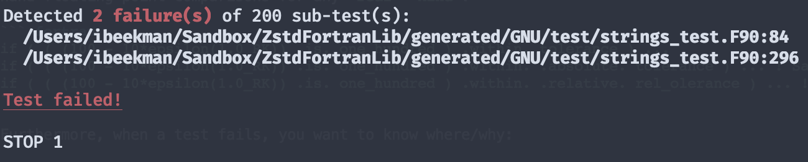

<div align="center">

# ZstdFortranLib: Zaak's (missing) Standard Fortran Library

[![CI Status][GHA CI img]][GH Actions CI]
[![Coverage status][Test Coverage img]][Code Coverage]
[![Documentation Status][Docs img]][Documentation]
[![GitHub license][license img]][license]
[![Download as PDF][pdf img]][README.pdf]
[![Tweet this button][twitter img]][default tweet]

</div>

Implements missing functionality such as error handling, strings manipulation, system/environment interface &
testing utilities.

<details>
<summary>Table of contents</summary>

<!-- toc -->

- [:warning:Warning :warning:](#warningwarning-warning)
- [Motivation](#motivation)
- [Error Stack Object](#error-stack-object)
  * [Features](#features)
- [Unit Testing](#unit-testing)
  * [Syntactic Sugar](#syntactic-sugar)
  * [(Sub)Test Summarizing](#subtest-summarizing)
- [Documentation](#documentation)
- [Templating](#templating)

<!-- tocstop -->

</details>

## :warning:Warning :warning:

This is currently __pre-alpha__ software. Development is ongoing and the API is not yet stable.
It is possible that documented functionality is not yet implemented.

## Motivation

Certain tasks in Fortran can be awkward and there is no standard library.
One often ends up re-inventing the wheel to solve common tasks. Selected pain points include:

- String manipulation
- File operations & IO
- Error handling
- Assertions
- Interfacing with the OS, file system & environment
- Writing tests quickly and expressively

For string, file, and OS/system/environment interfacing other languages, in particular Ruby and Python
provide great expressiveness and built in functionality. These capabilities, as implemented in
`ZstdFortraLib` are inspired by and aim to replicate the corresponding functionality in Ruby and Python,
but in an idiomatic Fortran way, and only the features & functions that make sense.

Additionally unit testing and assertions should be expressive, quick to write and implement, and
some assertions should be able to easily be turned off for production builds, or used to signal errors
that are handled later.

## Error Stack Object

By providing an error stack object, either as a singleton module variable, or as a component of a derived type,
the programmer can maintain a call-stack, complete with line numbers and file names, and raise or signal
exceptions deep in the call stack in pure or elemental procedures, but return control and handle any
exceptions in less performance-critical, non-pure, higher-level program units.

### Features

- Dynamically sized error stack
- Convenience macro for injecting line number and file-name into call-stack
- Built in error types
- Custom error messages
- Pretty output to terminal, dynamically formatted
- Raise fatal or deferred exceptions
- Check if exceptions are signaling
- Handle exceptions
- Signal handler hooks
- Introspective CMake build system, with exported targets

## Unit Testing

### Syntactic Sugar

Floating point comparisons are common in scientific computing and Fortran. Special operators are provided to
hand floating point comparisons for any `real` `kind`:

``` fortran
if ( ( (100 - 10*epsilon(1.0_RK)) .is. one_hundred ) .within. tolerance ) ...

! Same as above, absolute is default
if ( ( (100 - 10*epsilon(1.0_RK)) .is. one_hundred ) .within. .absolute. tolerance ) ...

! R.H.S. value is taken to be truth
if ( ( (100 - 10*epsilon(1.0_RK)) .is. one_hundred ) .within. .relative. rel_olerance ) ...
```

Furthermore, when a test fails, you want to know where/why:

``` fortran
    OUTPUT = gsub(qbf, CK_"the", CK_"a")
    call assert_delayed ( &
      OUTPUT ==  CK_"a quick red fox jumped over a lazy dog", __LINE__ , &
      "character(kind=CK) gsub 'the --> a' substitution failed")
```

### (Sub)Test Summarizing

If a failure occurs the output will look like:



## Documentation

High level user documentation is published (from the [`docs`](./docs) directory) to
[Read the Docs](https://zstdfortranlib/readthedocs.io) <https://zstdfortranlib/readthedocs.io>.

User/client API documentation (protected & public scope) as well as project developer documentation
(private scope & public/protected)will be generate via [FORD] and published
via GitHub pages to https://izaakbeekman.com/ZstdFortranLib (:warning: not yet operational :warning:)

## Templating

This project uses templating and compile-time polymorphism (procedure overloading) for
improving the functionality of operators on intrinsic types. Templating functionality is
provided via the [Jin2For] tool, which adds functionality to the [Jinja2] templating enginep
specific to writing Fortran programs.

__:warning:NEVER MANUALLY EDIT SOURCES IN THE [`generated`] DIRECTORY! :warning:__


---

<div align="center">

[](https://github.com/zbeekman/ZstdFortranLib/fork)
[](https://github.com/zbeekman/ZstdFortranLib)
[](https://github.com/zbeekman/ZstdFortranLib)
[![Tweet this button][twitter img]][default tweet]

</div>

[GHA CI img]: https://github.com/zbeekman/ZstdFortranLib/workflows/CI/badge.svg "CI build status badge"
[GH Actions CI]: https://github.com/zbeekman/ZstdFortranLib/actions "GH Actions CI"
    [Test Coverage img]: https://codecov.io/gh/zbeekman/ZstdFortranLib/branch/develop/graph/badge.svg?flag=unittest_core "Codecov badge"
[Code Coverage]: https://codecov.io/gh/zbeekman/ZstdFortranLib/branch/develop "Code Coverage"
[Docs img]: https://readthedocs.org/projects/zstdfortranlib/badge/?version=latest "RTD badge"
[Documentation]: https://zstdfortranlib.readthedocs.io/en/latest/?badge=latest "High level documentation"
[license img]: https://img.shields.io/badge/license-MIT-blue.svg "MIT License badge"
[license]: ./LICENSE "ZstdFortranLib License (MIT)"
[pdf img]: https://img.shields.io/badge/PDF-README.md-6C2DC7.svg "Download this readme as a PDF"
[README.pdf]: https://md2pdf.herokuapp.com/zbeekman/ZstdFortranLib/blob/master/README.pdf "PDF of this README"
[twitter img]: https://img.shields.io/twitter/url/http/shields.io.svg?style=social
[default tweet]: https://twitter.com/intent/tweet?hashtags=Fortran&related=zbeekman,gnutools,DegenerateConic,jeffdotscience,realmilancurcic,ljdursi,sci_vision&text=Checkout%20ZstdFortranLib,%20the%20missing%20Fortran%20Standard%20Library:%20Error,%20string,%20file%20and%20testing%20classes,%20syntactic%20sugar%20and%20more!&url=https%3A//github.com/zbeekman/ZstdFortranLibrary&via=zbeekman

[FORD]: https://github.com/Fortran-FOSS-Programmers/ford
[`generated`]: ./generated
[Jin2For]: https://gitlab.com/fverdugo/jin2for
[Jinja2]: https://jinja.palletsprojects.com/en/2.10.x/
